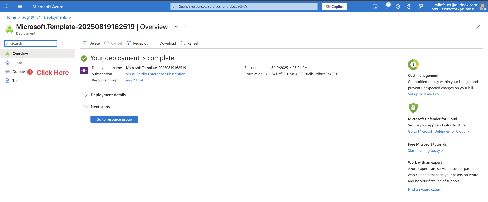
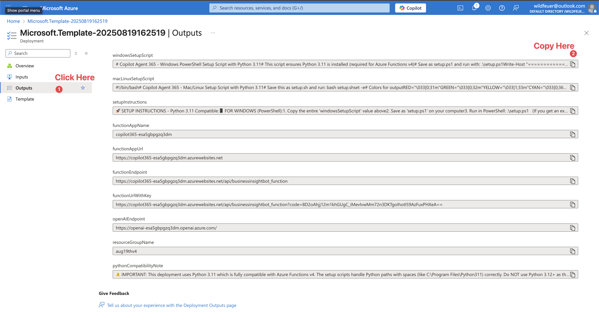

# Copilot Agent 365 - Enterprise AI Assistant

## 🚀 One-Click Setup - Fully Automated!

### Step 1: Deploy to Azure (1 minute)
[](https://portal.azure.com/#create/Microsoft.Template/uri/https%3A%2F%2Fraw.githubusercontent.com%2Fkody-w%2FCopilot-Agent-365%2Fmain%2Fazuredeploy.json)

### Step 2: Copy & Run Setup Script (2 minutes)

After deployment completes, you'll see "Your deployment is complete" ✅

1. Click the **"Outputs"** tab on the left sidebar (see screenshots below)
2. Find and copy the entire script value:
   - **Windows users**: Copy `windowsSetupScript` 
   - **Mac/Linux users**: Copy `macLinuxSetupScript`
3. Save it as a file and run:


*First, click on "Outputs" in the left sidebar*


*Then copy your platform's setup script*

**Windows (PowerShell):**
```powershell
.\setup.ps1
```
If you get a security error, first run: `Set-ExecutionPolicy RemoteSigned -Scope CurrentUser`

**Mac/Linux (Terminal):**
```bash
bash setup.sh
```

**That's it!** Your AI assistant is now running both in Azure and locally with all settings automatically configured. 🎉

---

## ✨ What You Get

- 🧠 **GPT-4 Powered** - Latest Azure OpenAI models
- 💾 **Persistent Memory** - Remembers conversations across sessions
- 🔐 **Enterprise Security** - Function-level authentication
- ⚡ **Auto-scaling** - Serverless Azure Functions
- 🎨 **Web Chat Interface** - Beautiful UI included
- 🔧 **Zero Configuration** - All Azure settings automatically configured

## 🎯 Key Features

### Fully Automated Setup
- **Auto-installs Python 3.11** if not found (required for Azure Functions v4)
- **Handles all path issues** including spaces in "Program Files"
- **Configures all Azure settings** automatically from your deployment
- **No manual editing required** - everything just works!

### Memory System
- Stores conversation context per user
- Maintains shared knowledge base
- Persistent across sessions

### Agent System
- Modular agent architecture
- Easy to add custom agents
- Built-in memory management agents

## 📋 Prerequisites

The setup script will automatically install missing components, but you'll need:

### Windows
- **Azure Account** - [Get free trial](https://azure.microsoft.com/free/)
- **PowerShell** - Already installed on Windows
- Everything else auto-installs! ✨

### Mac/Linux
- **Azure Account** - [Get free trial](https://azure.microsoft.com/free/)
- **Python 3.9-3.11** - `brew install python@3.11` (Mac) or `apt-get install python3.11` (Linux)
- **Git** - `brew install git` (Mac) or `apt-get install git` (Linux)
- **Node.js** - `brew install node` (Mac) or from [nodejs.org](https://nodejs.org/)

Then install Azure Functions Core Tools:
```bash
npm install -g azure-functions-core-tools@4
```

## 🎯 Quick Start After Setup

Once setup is complete, you can start your bot anytime with:

### Windows
```powershell
cd Copilot-Agent-365
.\run.ps1
```

### Mac/Linux
```bash
cd Copilot-Agent-365
./run.sh
```

Then:
- **Local API**: http://localhost:7071/api/businessinsightbot_function
- **Web Chat**: Open `client/index.html` in your browser
- **Azure URL**: Automatically shown after setup (includes auth key)

## 💬 Test Your Bot

### PowerShell (Windows)
```powershell
Invoke-RestMethod -Uri "http://localhost:7071/api/businessinsightbot_function" `
  -Method Post `
  -Body '{"user_input": "Hello", "conversation_history": []}' `
  -ContentType "application/json"
```

### Curl (Mac/Linux)
```bash
curl -X POST http://localhost:7071/api/businessinsightbot_function \
  -H "Content-Type: application/json" \
  -d '{"user_input": "Hello", "conversation_history": []}'
```

## 🛠️ Customization

### Change Your Bot's Personality
Edit these in Azure Portal → Function App → Configuration:
- `ASSISTANT_NAME` - Your bot's name
- `CHARACTERISTIC_DESCRIPTION` - Your bot's personality

### Add Custom Agents
Create new file in `agents/` folder:
```python
from agents.basic_agent import BasicAgent

class MyCustomAgent(BasicAgent):
    def __init__(self):
        self.name = 'MyCustom'
        self.metadata = {
            "name": self.name,
            "description": "What this agent does",
            "parameters": {
                "type": "object",
                "properties": {
                    "input": {
                        "type": "string",
                        "description": "Input parameter"
                    }
                },
                "required": ["input"]
            }
        }
        super().__init__(self.name, self.metadata)
    
    def perform(self, **kwargs):
        input_data = kwargs.get('input', '')
        # Your logic here
        return f"Processed: {input_data}"
```

## 🔄 How It Works

### Deployment Process
1. **Azure deploys** all resources (OpenAI, Storage, Function App)
2. **Setup script** is generated with YOUR credentials embedded
3. **Running the script**:
   - Installs Python 3.11 if needed
   - Clones the repository
   - Creates `local.settings.json` with your Azure values
   - Sets up Python environment
   - Installs all dependencies
   - Creates run scripts

### No Manual Configuration!
The setup script automatically includes:
- ✅ Your Azure Storage connection string
- ✅ Your OpenAI API key and endpoint
- ✅ Your Function App details
- ✅ All other required settings

## 📁 Project Structure

```
Copilot-Agent-365/
├── function_app.py            # Main Azure Function
├── agents/                    # AI agents
│   ├── basic_agent.py        # Base agent class
│   ├── context_memory_agent.py
│   └── manage_memory_agent.py
├── utils/                     # Utilities
│   └── azure_file_storage.py
├── client/                    # Web UI
│   └── index.html
├── requirements.txt           # Python dependencies
├── host.json                  # Azure Functions config
├── run.ps1                    # Windows run script (auto-created)
├── run.bat                    # Windows batch script (auto-created)
├── run.sh                     # Mac/Linux run script (auto-created)
└── local.settings.json        # Azure settings (auto-created with YOUR values)
```

## 🚨 Troubleshooting

| Issue | Solution |
|-------|----------|
| "Python 3.11 not found" | Script auto-installs it! Just wait 2-3 minutes |
| "C:\Program Files" error | Fixed! Script handles spaces in paths |
| "func: command not found" | Run: `npm install -g azure-functions-core-tools@4` |
| Port already in use | Edit `run.ps1` or `run.sh` and change to `func start --port 7072` |
| "az login" needed | Run `az login` to deploy code to Azure (optional) |

## 💡 Python Version Important!
- **Use Python 3.11** (automatically installed by script)
- **Don't use Python 3.13+** (causes compatibility issues with Azure Functions)
- Script specifically installs and uses Python 3.11 to avoid issues

## 💰 Cost

- **Function App**: ~$0 (free tier covers most usage)
- **Storage**: ~$5/month
- **OpenAI**: Pay per token used (~$0.01 per 1K tokens)

**Total: ~$5/month + OpenAI usage**

## 🔐 Security

- **API keys are embedded securely** in the generated setup script
- **Never commit** `local.settings.json` to Git (contains secrets)
- **Function requires authentication** key for API access
- **All traffic uses HTTPS**
- **Keys are unique** to your deployment

## 🆕 What's New

### Version 2.0 - Full Automation
- ✨ **Auto-configuration** - No manual editing of settings
- 🔧 **Python path fix** - Handles "Program Files" spaces
- 🐍 **Python 3.11 auto-install** - Windows script installs if missing
- 📦 **Fixed package versions** - Prevents compatibility issues
- 🚀 **True one-click deploy** - Everything configured automatically

## 🤝 Contributing

1. Fork the repo
2. Create your feature branch (`git checkout -b feature/AmazingFeature`)
3. Commit changes (`git commit -m 'Add some AmazingFeature'`)
4. Push to branch (`git push origin feature/AmazingFeature`)
5. Open a Pull Request

## 📜 License

MIT License - See [LICENSE](LICENSE)

## 🆘 Support

- **Issues**: [GitHub Issues](https://github.com/kody-w/Copilot-Agent-365/issues)
- **Discussions**: [GitHub Discussions](https://github.com/kody-w/Copilot-Agent-365/discussions)

## 🌟 Why This Project?

This project makes enterprise AI accessible to everyone by:
- **Removing complexity** - One-click deployment with zero configuration
- **Handling all setup** - Automatically installs and configures everything
- **Providing memory** - Your AI remembers context across conversations
- **Enabling customization** - Easy to add your own agents and features

---

<p align="center">
  <strong>Deploy your own AI assistant in under 3 minutes!</strong>
  <br><br>
  <a href="https://github.com/kody-w/Copilot-Agent-365">⭐ Star this repo</a> if it helped you!
  <br><br>
  Made with ❤️ for the community
</p>