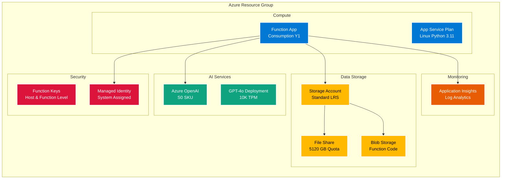

# Copilot Agent 365 - System Architecture Diagram

## Enterprise Architecture Overview

```mermaid
graph TB
    subgraph "End User Layer"
        A[Microsoft Teams User]
        B[Web Browser Client]
        C[Mobile App]
    end
    
    subgraph "Microsoft Copilot Studio"
        D[Copilot Studio Agent]
        E[Conversation Flow]
        F[Topic Triggers]
    end
    
    subgraph "Azure API Gateway"
        G[Azure API Management]
        H[Authentication & Authorization]
    end
    
    subgraph "Azure Functions - Consumption Plan"
        I[HTTP Trigger Function<br/>businessinsightbot_function]
        J[Function Runtime<br/>Python 3.11]
        K[CORS Handler]
    end
    
    subgraph "Agent Orchestration Layer"
        L[Assistant Class]
        M[Agent Loader]
        N[Response Parser]
    end
    
    subgraph "AI Agent System"
        O[Context Memory Agent]
        P[Manage Memory Agent]
        Q[Email Drafting Agent]
        R[Adaptive Card Agent]
        S[Custom Agents<br/>Dynamic Loading]
    end
    
    subgraph "Azure OpenAI Service"
        T[GPT-4/GPT-4o Deployment]
        U[Chat Completions API]
        V[Function Calling]
    end
    
    subgraph "Azure Storage Account"
        W[Azure File Share<br/>Persistent Memory]
        X[Shared Memories<br/>Cross-User Context]
        Y[User-Specific Memories<br/>GUID-based Storage]
        Z[Agent Files<br/>Dynamic Agent Storage]
    end
    
    subgraph "Monitoring & Logging"
        AA[Application Insights]
        AB[Function Metrics]
        AC[Error Tracking]
    end
    
    %% User Interactions
    A -->|1. User Message| D
    B -->|1. HTTP Request| G
    C -->|1. Mobile Request| G
    
    %% Copilot Studio to Function
    D -->|2. Action Trigger| G
    E -->|Route to Custom Action| G
    F -->|Topic Match| G
    
    %% API Gateway to Function
    G -->|3. Authenticated Request| H
    H -->|4. Forward with Token| I
    
    %% Function Processing
    I -->|5. Request Validation| K
    K -->|6. Parse JSON Payload| J
    J -->|7. Initialize Assistant| L
    
    %% Agent Orchestration
    L -->|8. Load Available Agents| M
    M -->|9. Scan Agent Files| S
    M -->|10. Import from Storage| Z
    L -->|11. Retrieve Context| O
    
    %% Memory Retrieval
    O -->|12. Fetch Shared Memory| X
    O -->|13. Fetch User Memory| Y
    
    %% OpenAI Processing
    L -->|14. Prepare Messages<br/>System + Context + History| U
    U -->|15. Send Chat Request| T
    T -->|16. Analyze Intent| V
    V -->|17. Function Call Decision| L
    
    %% Agent Execution
    L -->|18. Execute Agent| P
    P -->|19. Store Memory| W
    L -->|18. Execute Agent| Q
    L -->|18. Execute Agent| R
    
    %% Memory Updates
    P -->|20. Update Shared Context| X
    P -->|21. Update User Context| Y
    
    %% Response Flow
    T -->|22. Generate Response| U
    U -->|23. Formatted + Voice Response| L
    L -->|24. Parse Response Parts| N
    N -->|25. Split Formatted/Voice| J
    
    %% Return to User
    J -->|26. JSON Response<br/>{assistant_response, voice_response}| I
    I -->|27. Add CORS Headers| K
    K -->|28. HTTP 200 Response| G
    G -->|29. Return to Client| D
    D -->|30. Display in Teams| A
    G -->|30. Display in Browser| B
    G -->|30. Display in App| C
    
    %% Monitoring
    I -.->|Logs & Metrics| AA
    L -.->|Agent Execution Logs| AB
    J -.->|Errors & Exceptions| AC
    T -.->|Token Usage| AA
    
    %% Styling
    classDef azure fill:#0078D4,stroke:#fff,stroke-width:2px,color:#fff
    classDef openai fill:#10A37F,stroke:#fff,stroke-width:2px,color:#fff
    classDef storage fill:#FFB900,stroke:#fff,stroke-width:2px,color:#000
    classDef agent fill:#8B5CF6,stroke:#fff,stroke-width:2px,color:#fff
    classDef user fill:#50E6FF,stroke:#fff,stroke-width:2px,color:#000
    classDef copilot fill:#7F5AF0,stroke:#fff,stroke-width:2px,color:#fff
    
    class A,B,C user
    class D,E,F copilot
    class G,H,I,J,K azure
    class L,M,N,O,P,Q,R,S agent
    class T,U,V openai
    class W,X,Y,Z storage
    class AA,AB,AC azure
```

## Data Flow Sequence


## Component Architecture



## Agent Execution Flow


## Memory Architecture


## Deployment Architecture


## Integration with Microsoft Copilot Studio


## Key Features

### 🔐 Security
- Function-level authentication with key-based access
- System-assigned managed identity
- HTTPS-only traffic with TLS 1.2+
- CORS configuration for web clients

### ⚡ Scalability
- Serverless consumption plan (auto-scaling)
- Stateless function design
- Persistent context via Azure Storage
- Up to 200 concurrent instances

### 🧠 AI Capabilities
- GPT-4o latest models with 10K TPM
- Function calling for agent orchestration
- Dual response format (formatted + voice)
- Context-aware memory system

### 💾 Memory System
- Shared cross-user knowledge base
- User-specific GUID-based memory
- Persistent storage in Azure File Share
- Full recall and filtered retrieval

### 🔧 Extensibility
- Dynamic agent loading from storage
- Custom agent creation support
- Multi-agent orchestration
- Modular architecture

## Technical Stack

| Layer | Technology |
|-------|------------|
| **Platform** | Azure Functions (Consumption Plan) |
| **Runtime** | Python 3.11 |
| **AI** | Azure OpenAI GPT-4o |
| **Storage** | Azure File Share |
| **Monitoring** | Application Insights |
| **Frontend** | Microsoft Teams via Copilot Studio |
| **API** | REST with JSON |
| **Authentication** | Function Keys + Managed Identity |

## Cost Optimization

- **Consumption Plan**: Pay only for execution time
- **Storage**: Standard LRS for cost efficiency
- **OpenAI**: Token-based pricing (~$0.01/1K tokens)
- **Monthly Estimate**: ~$5-10 + token usage

